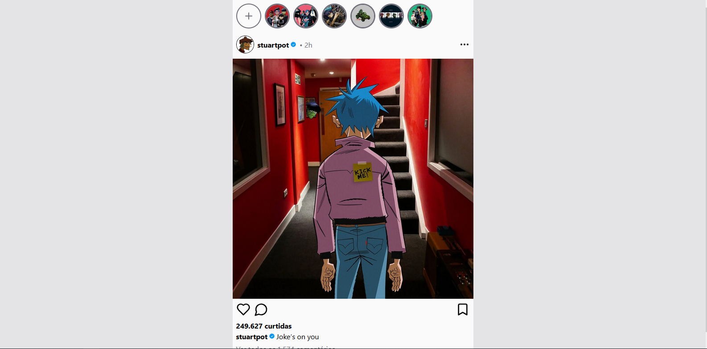

# 24hr Story Feature 



## Descrição

Projeto desenvolvido como parte de um desafio proposto pelo site [roadmap.sh](https://roadmap.sh) para praticar habilidades como armazenamento do lado do cliente (local storage) e timeout.

[Link do site](https://24hr-story-feature-lheerme.vercel.app)

[Link do desafio](https://roadmap.sh/projects/stories-feature)


## Funcionalidades

- Exibição sequencial de stories.
- Botão de pausar/retomar story.
- Navegação automática para o próximo story.
- Expiração automática dos stories após 24 horas.
- Persistência de dados com `localStorage`

## Como Executar

1. Clone este repositório em sua máquina local.
2. Instale as dependências usando o comando:
   ```
   npm install
   ```
3. Inicie o aplicativo com:
   ```
   npm run dev
   ```
4. Abra o aplicativo no seu navegador.